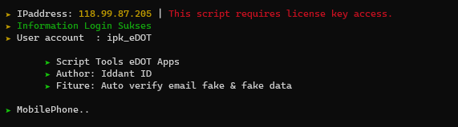
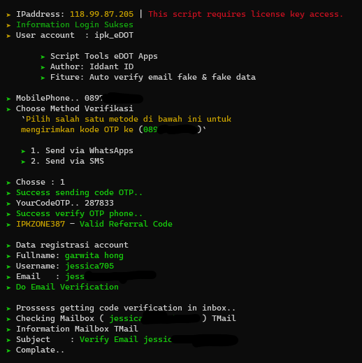

# eDOT
Tools eDOT Apps | Suntik Refferal Code
<center></center>
<center></center>

Installations tools eDOT Apps command in 
```
$ git clone https://github.com/ipkzone/eDOT
$ cd eDOT
$ php eDOT.php --eDOT
```
Step installations Installer check this link
> https://github.com/ipkzone/installerhmsc

Contact admin for [Order Script](https://api.whatsapp.com/send?phone=62895375136311&text=Hallo%20mau%20order%20script%20eDOT%20bos).<br>

# Note
The script runs with the license key,
if you don't have a license key then you can't run it,
to get a license key you have to ask the creator for its activation for a donation of course,
This script blocks multiple user logins so that the script remains safe and secure.

Regards,
**Iddant ID**
